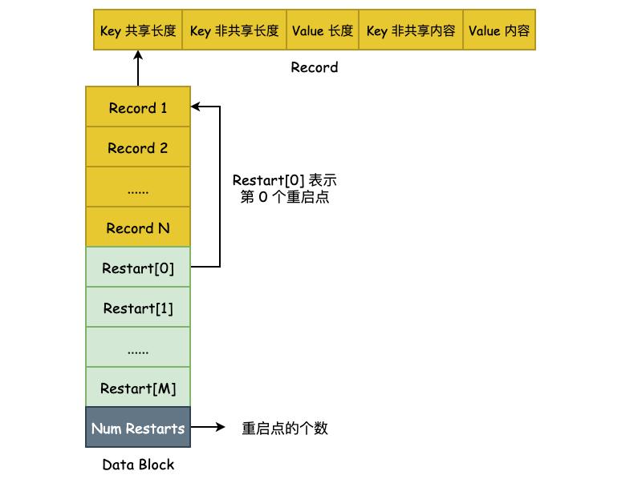

# SSTable——概览与 Data Block


上图为 SSTable 格式的总览，**主要由 Data Block、 Meta Block、Metaindex Block、Index Block 以及 Footer 所组成**，主要分为 3 部分: 用户数据、元数据以及索引数据，其作用如下:

- Data Block: 按照 `Comparator` 所定义的大小关系按顺序存储 User Key 以及 User Value。为了节省存储空间，leveldb 将会对 User Key 进行前缀压缩存储，将于下文详述。
- Meta Block: 用于快速 filter 某一个 User Key 是否在当前 SSTable 中，默认为 Bloom Filter。
- Metaindex Block: 指向 Meta Block 的索引，用于快速定位 Meta Block。
- Index Block: 指向 Data Block 的索引，用于快速定位 Data Block。
- Footer: 其中包含了 Metaindex Handle 和 Index Handle，其中 Metaindex Handle 指向 Metaindex Block 的起始位置和大小，Index Handle 则指向了 Index Block 的起始位置和大小，可以认为是索引的索引。

## 1. Data Block

User Key 和 User Value 在 leveldb 中是未做分离处理的，也就是说每一对 Key-Value 都会按照一定的顺序存储到 Data Block 中，并且 Data Block 是从文件起始位置连续存储的。在一个 Data Block 中，可能会有多条数据记录，同时由于这些数据记录是有序存储的（默认为字典序），那么相邻的两条数据之间的 User Key 就有很大的可能性出现前缀重叠，如下图的 4 个 User Key，它们都具有相同的 "sma" 前缀:


如此一来，leveldb 就可以对其进行前缀压缩处理了。对于有序的字符串而言，这么做能够节省非常多的存储空间，但是会对查询增加复杂度，也会影响查询效率。因此，leveldb 为了解决这个问题，额外引入了 Restart Point（重启点）。

Restart Point 的实现非常简单，leveldb 规定每隔 K 个 User Key，将不采用前缀压缩，而是直接存储整个 User Key，用于降低查询时的复杂度。K 值定义在 `Options.block_restart_interval` 中，默认为 16。也就是说，每隔 16 个 User Key 就存储完整的记录。同时，使用 Restart 数组来记录下这些 Restart Point 的文件偏移量，便于进行二分查找。如下图所示:



Data Block 的构建是由 `BlockBuilder` 来完成的，类定义本身非常简单，如下所示:

```cpp
class BlockBuilder {
public:
    explicit BlockBuilder(const Options* options);
    
    BlockBuilder(const BlockBuilder&) = delete;
    BlockBuilder& operator=(const BlockBuilder&) = delete;
    
    /* 清空相关字段内容 */
    void Reset();
    
    /* 添加一个 Key-Value 对 */
    void Add(const Slice& key, const Slice& value);
    
    /* 完成 Block 的构建，压入重启点信息，并返回 buffer_，设置 finished_ 为 true */
    Slice Finish();
    
    /* 返回 Block 的预估大小 */
    size_t CurrentSizeEstimate() const;
    
    /* 判断 buffer_ 是否为空 */
    bool empty() const { return buffer_.empty(); }

private:
    const Options* options_;          /* Options 对象 */
    std::string buffer_;              /* User Space 缓冲区 */
    std::vector<uint32_t> restarts_;  /* Restart Points 数组 */
    int counter_;                     /* Entry 计数器，用于重启点的计算 */
    bool finished_;                   /* 是否已经调用了 Finish() 方法 */
    std::string last_key_;            /* 最后添加的 Key */
};
```

### 1.1 `BlockBuilder::Add()`

`BlockBuilder::Add(const Slice& key, const Slice& value)` 向 Block 中添加一个 User Key 与 User Value，由于 Block 中的数据是有序存储的，那么此时该 User Key 必须要大于最后一个被添加到 Block 的 User Key，也就是 `last_key_`:

```cpp
/* 获取 last_key_ */
Slice last_key_piece(last_key_);
assert(!finished_);
assert(counter_ <= options_->block_restart_interval);
/* 要么 buffer_ 为空，要么 key 大于最后一个被添加到 Block 中的 Key */
assert(buffer_.empty()  // No values yet?
       || options_->comparator->Compare(key, last_key_piece) > 0);
```

紧接着，判断 `counter_` 和 `Options.block_restart_interval` 之间的大小关系，如果 `counter_` 小于 `Options.block_restart_interval` 的话，说明还没有到重启点，采用前缀压缩的方式存储。否则，就将当前 User Key 作为重启点，全量存储，并更新 `restarts_` 数组:

```cpp
size_t shared = 0;

/* 如果 counter_ < block_restart_interval 的话，说明还没有到重启点，直接进行前缀压缩处理 */
if (counter_ < options_->block_restart_interval) {
    /* last_key_ 就像链表里面儿的 prev 指针一样，只需要计算当前 User Key 和 last_key_ 有多少重合度即可 */
    const size_t min_length = std::min(last_key_piece.size(), key.size());
    /* 统计前缀长度 */
    while ((shared < min_length) && (last_key_piece[shared] == key[shared])) {
      shared++;
    }
} else {
    /* 此时 counter_ 必然等于 block_restart_interval，需要建立新的重启点 */
    restarts_.push_back(buffer_.size());
    counter_ = 0;
}
```

最后，根据前缀长度 `shared` 就可以构建出一条存储记录了，非前缀压缩的记录和没有相同前缀的 User Key 的 `shared` 为 0，这点需要注意。

```cpp
/* 获取 key 和 last_key_ 的非共享长度 */
const size_t non_shared = key.size() - shared;

/* 使用变长编码，将 "<shared><non_shared><value_size>" 写入 buffer_ */
PutVarint32(&buffer_, shared);
PutVarint32(&buffer_, non_shared);
PutVarint32(&buffer_, value.size());

/* 将 User Key 非共享内容压入 buffer_ */
buffer_.append(key.data() + shared, non_shared);
/* 将完整的 Value 压入 buffer_ */
buffer_.append(value.data(), value.size());

/* 更新 last_key_ 为当前 User Key */
last_key_.resize(shared);
last_key_.append(key.data() + shared, non_shared);
assert(Slice(last_key_) == key);
counter_++;
```

### 1.2 `BlockBuilder::Finish()`

当上层调用方使用 `BlockBuilder::Add()` 方法向 `buffer_` 中添加数据并达到一定量级以后，就可以调用 `Finish()` 方法将 `restarts_` 数组压入到 `buffer_` 中并返回完整的 Data Block 数据了:

```cpp
Slice BlockBuilder::Finish() {
    /* 压入 restarts_ 数组中的全部内容至 buffer_ */
    for (size_t i = 0; i < restarts_.size(); i++) {
        PutFixed32(&buffer_, restarts_[i]);
    }
    /* 压入 Restart Points 数量 */
    PutFixed32(&buffer_, restarts_.size());
    /* 设置结束标志位 */
    finished_ = true;
    /* 返回完整的 Buffer 内容 */
    return Slice(buffer_);
}
```