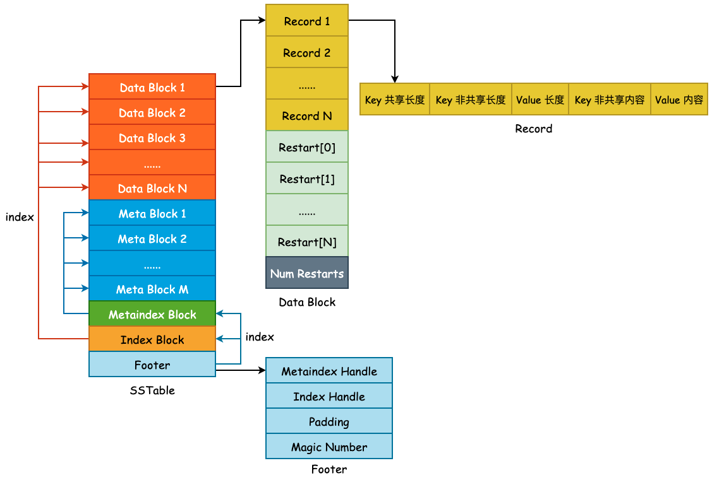
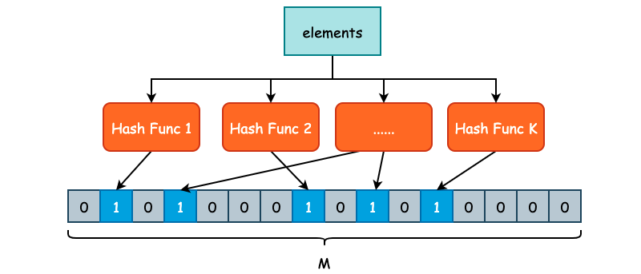
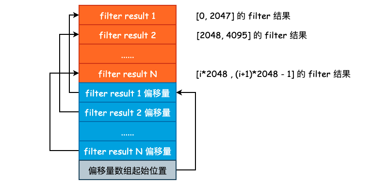

# SSTable——Meta Block



本节描述 SSTable 第二个关键组成部分，Meta Block。Meta Block 存在的目的就是为了优化 SSTable 的读取性能，leveldb 使用 Bloom Filter 作为 Filter 的具体实现，用于快速判断某一个 User Key 是否存在于当前查找的 SSTable 中。若 Bloom Filter 给出了 `false` 的答案，那么待查找 User Key 必然不在当前 SSTable 中。若给出了 `true` 的答案，待查找 User Key 也不一定会在当前 SSTable 中，因为 Bloom Filter 存在“假阳性”的可能。

## 1. Bloom Filter

Bloom Filter 又称之为布隆过滤器，是一种空间利用率非常高的数据结构，使用位数组（Bit Array）简洁地表示一个集合，并使用不同的哈希函数将元素映射到这一位数组表示的集合中，从而快速判断元素是否存在于当前集合中。

Bloom Filter 的高效性是有代价的，当我们判断一个元素是否在集合时，有可能会把不属于这个集合的元素误认为属于这个集合，这其实就是常说的“假阳性”（False Positive）。假阳性出现的根本原因就是哈希碰撞，尽管 Bloom Filter 会使用不同的哈希函数，但是由于是把无限的元素映射到有限集合内，出现碰撞的情况在所难免。

因此，Bloom Filter 并不适用于“绝对准确”的场景，而适用于能够容忍一些错误的情景下，比如爬虫系统的 URL 去重、缓存系统的前置判断等。



如上图所示，我们定义了 K 个不同的哈希函数，同时底层位数组的长度为 M。对于每一个需要被添加至 Bloom Filter 的元素，都需要经过 K 次哈希函数的计算，得到 K 个哈希结果。每一个结果都需要被映射到 `[0, M-1]` 这一区间内，并将位数组对应的位置置为 1。

在判断某一个元素 E 是否存在集合时，同样对 E 进行 K 次哈希计算，并映射到 `[0, M-1]` 区间内，如果每一个位置的值都是 1 的话，那么 Bloom Filter 就认为 E 在这个集合中，反之 E 不在集合中。

由于 Bloom Filter 使用了 K 个不同的哈希函数，减少了哈希碰撞的概率，因此，Bloom Filter 虽然会存在假阳性的情况出现，但是出现概率并不高。

假设位数组的大小为 M，用户插入数据总量为 N，并且存在 K 个哈希函数，为了获得比较好的过滤表现，K 的取值应为 `ln2 * (M/N)`。在错误率不大于 E 的情况下，M 至少应该为 `N * lg(1/E)` 才能在有 N 个元素的情况下表现良好。

## 2. Filter Policy

虽然 leveldb 使用了 Bloom Filter 作为 Filter Policy 的具体实现，但是 leveldb 为了能够让用户自定义过滤器，仍然定义了 `FilterPolicy` 这个接口，该接口一共只有 3 个方法:

```cpp
class LEVELDB_EXPORT FilterPolicy {
public:
    virtual ~FilterPolicy();
    
    /* 返回过滤策略的名称 */
    virtual const char* Name() const = 0;
    
    /* 将 n 个 User Key 添加至 dst 中 */
    virtual void CreateFilter(const Slice* keys, int n,
                            std::string* dst) const = 0;
    
    /* 判断 key 是否在 filter 集合中 */
    virtual bool KeyMayMatch(const Slice& key, const Slice& filter) const = 0;
};
```

`BloomFilterPolicy` 则是 `FilterPolicy` 的具体实现，比较重要的就是其构造函数，决定了位数组的 M 大小和哈希函数 K 的个数:

```cpp
class BloomFilterPolicy : public FilterPolicy {
public:
    explicit BloomFilterPolicy(int bits_per_key) : bits_per_key_(bits_per_key) {
        k_ = static_cast<size_t>(bits_per_key * 0.69);  // 0.69 =~ ln(2)
        if (k_ < 1) k_ = 1;
        if (k_ > 30) k_ = 30;
  }
```

其中 `bits_per_key` 表示为每个 key 所分配的位数， 简单来说就是 `M/N` 的值，这个值只需要大于 1.44 Bloom Filter 就可以得到良好的工作表现。如果存储空间足够的话，`bits_per_key` 通常取 10，此时错误率大约在 1%。K 的计算实际上就是 `ln2 * (M/N)`，由数学推导而来。


## 3. Filter Block

Filter Block 其实就是 Meta Block，使用 Filter Block 的原因在于这个名称更容易理解 Meta Block 的作用到底是什么。在前面一节中我们已经明白了 Data Block 是由 `BlockBuilder` 所构建的，包含了前缀压缩和重启点这两个非常重要的概念。Filter Block 则是由 `FilterBlockBuilder` 所构建的，其中就会包含最为重要的 `FilterPolicy`。

`FilterBlockBuilder` 的定义也并不复杂，主要有 3 个方法:

- `StartBlock()`: 开始构建新的 Filter Block。
- `AddKey()`: 添加一个新的 key，将在 `TableBuilder` 中被调用。
- `Finish()`: 结束 Filter Block 的构建，并返回 Filter Block 的完整内容。

完整类定义如下:

```cpp
class FilterBlockBuilder {
public:
    explicit FilterBlockBuilder(const FilterPolicy*);
    
    FilterBlockBuilder(const FilterBlockBuilder&) = delete;
    FilterBlockBuilder& operator=(const FilterBlockBuilder&) = delete;
    
    /* 开始构建新的 Filter Block */
    void StartBlock(uint64_t block_offset);
    
    /*添加一个新的 key，将在 `TableBuilder` 中被调用*/
    void AddKey(const Slice& key);
    
    /*结束 Filter Block 的构建，并返回 Filter Block 的完整内容*/
    Slice Finish();

private:
    void GenerateFilter();          /* 构建一个 Filter */
    
    const FilterPolicy* policy_;    /* filter 类型，如 BloomFilterPolicy */
    std::string keys_;              /* User Keys，全部塞到一个 string 中 */
    std::vector<size_t> start_;     /* 每一个 User Key 在 keys_ 中的起始位置 */
    std::string result_;            /* keys_ 通过 policy_ 计算出来的 filtered data */
    std::vector<Slice> tmp_keys_;   /* policy_->CreateFilter() 的参数 */
    
    /* filter 在 result_ 中的位置，filter_offsets_.size() 就是 Bloom Filter 的数量 */
    std::vector<uint32_t> filter_offsets_;  
};
```

在阅读具体实现之前需要先理清 Filter Block 的具体格式，在 `doc/table_format.md` 中有给出相应的说明。

首先，Filter Block 的作用就是对 SSTable 中 Data Block 的所有 User Key 建立布隆过滤器，并将结果（string 对象）写入到 Filter Block 中。如果说我们把所有的 User Key 都放在一个 Bloom Filter 中的话，按照 `bits_per_key` 为 10 来计算的话，就有如下计算过程:

假设 User Key 和 User Value 的平均长度为 32 字节，再加上辅助的 varint 字段，一条记录假设占用 70 字节的长度。一个 SSTable 的默认大小为 2MB，那么就可以存放 `2 * 1024 * 1024 / 70`，约为 3 万条记录。也就是说，布隆过滤器底层使用的位数组长度为 `30000 * 10 = 300000`，大约为 300KB。

在查询 SSTable 中，首先会去 Bloom Filter 中判断待查找 User Key 是否在当前 SSTable 中，那么就需要将这 300KB 的 Filter Result 全部读取到内存中进行判断，而常见的 I/O Buffer Size 大小为 4KB，也就是说，需要多次 I/O 才能将数据读取至内存。

**为了减少 I/O 时间，我们完全可以将单一的 Bloom Filter 划分成多个 Bloom Filter，每一个 Bloom Filter 只负责一部分的 User Key，并且由于 User Key 在 SSTable 中是有序存储的，因此可以很方便地建立 Filter Result 的索引**。这其实就是 Filter Block 和 Metaindex Block 所做的事情。

leveldb 采用的是按照固定大小进行划分，目前划分的大小为 2KB，也就是在 Data Block 中，每 2KB 的 User Key 和 User Value 就会有一个 Bloom Filter Result，如下图所示:



这里再对 `keys_`、`start_` 、`result_` 以及 `filter_offsets_` 做一个简单的解释。leveldb 中在存储 User Key 的时候，很少使用 `vector`，基本上都是使用 `string` 进行压缩存储的。因此，我们就需要使用一个额外的数组来充当 `string` 的索引，要不然我们也不知道一个 User Key 从哪里开始哪里结束，`start_` 和 `filter_offsets_` 就是干这个事儿的。

比如说我们想要获取 `keys_` 中的第 i 个 Key，就可以使用:

```cpp
const chr *base = keys_.data() + start[i];   /* 取得第 i 个 key 的起始地址 */
size_t length = start_[i + 1] - start_[i];   /* 取得第 i 个 key 的长度 */
Slice key = Slice(base, length);             /* 通过 Slice 构造 key */
```

### 3.1 Filter Block 的写入过程

Filter Block 通过 `FilterBlockBuilder::AddKey(const Slice& key)` 将 User Key 添加到 `keys_` 字符串中，需要注意的是，此时的 User Key 为打包之后的 `InternalKey`，也就是在尾部追加了 `Sequence Number | Value Type` 的结果，`InternalKey` 的格式可见 [leveldb 中的 varint 与 Key 组成](https://github.com/SmartKeyerror/reading-source-code-of-leveldb-1.23/tree/master/debug/articles/03-varint-and-key-format)。

```cpp
void FilterBlockBuilder::AddKey(const Slice& key) {
    Slice k = key;
    
    /* 注意这里是 keys_.size()，而不是 key.size()，
     * 记录的是每一个 key 在 keys_ 中的起始地址 */
    start_.push_back(keys_.size());
    keys_.append(k.data(), k.size());
}
```

将全部的 Internal Key 写入完毕以后，`TableBuilder` 将会调用 `StartBlock` 开始构建 Filter Block。此时需要将 Data Block 的结束偏移量传入，以便 Filter Block 计算到底需要多少个 Bloom Filter:

```cpp
void FilterBlockBuilder::StartBlock(uint64_t block_offset) {

    /* block_offset 可以认为是 Data Block 的结束偏移量，kFilterBase 的值其实就是 2048，
    * 即 2KB，filter_index 就表示需要创建多少个 Bloom Filter */
    uint64_t filter_index = (block_offset / kFilterBase);
    
    assert(filter_index >= filter_offsets_.size());
    
    /* filter_offsets_ 用于保存每个 Bloom Filter 的起始偏移量，因为每一个 
     * Bloom Filter 的长度可能是不同的，虽然 base 大小为 2KB，但是 User Key 的长度不定 */
    while (filter_index > filter_offsets_.size()) {
        GenerateFilter();
    }
}
```

`GenerateFilter()` 方法用于构建一个具体的 Filter Block K，其内部将会调用 `policy_->CreateFilter` 创建一个布隆过滤器，并将结果位数组（string 实现）返回。

```cpp
void FilterBlockBuilder::GenerateFilter() {

	/* 获取 key 的数量 */
	const size_t num_keys = start_.size();

	/* 如果 num_keys 为 0 的话，直接压入 result_.size() 并返回 */
	if (num_keys == 0) {
		filter_offsets_.push_back(result_.size());
		return;
	}

	start_.push_back(keys_.size());  // Simplify length computation

	/* tmp_keys_ 主要的作用就是作为 CreateFilter() 方法参数构建 Bloom Filter */
	tmp_keys_.resize(num_keys);

	/* 逐一取出 keys_ 中的所有 InternalKey，并扔到 tmp_keys_ 中 */
	for (size_t i = 0; i < num_keys; i++) {
		const char* base = keys_.data() + start_[i];  /* 取得第 i 个 key 的起始地址 */
		size_t length = start_[i + 1] - start_[i];    /* 取得第 i 个 key 的长度 */
		tmp_keys_[i] = Slice(base, length);           /* 通过 Slice 构造 key */
	}

	/* result_.size() 的初始值为 0，所以 filter_offsets_ 记录的是 Bloom Filter 结果的起始偏移量 */
	filter_offsets_.push_back(result_.size());
	
	/* 构建 Bloom Filter */
	policy_->CreateFilter(&tmp_keys_[0], static_cast<int>(num_keys), &result_);

	tmp_keys_.clear();
	keys_.clear();
	start_.clear();
}
```

最后，就是调用 `Finish()` 方法完成 Filter Block 的构建了，过程也比较简单，如下所示:

```cpp
Slice FilterBlockBuilder::Finish() {
    if (!start_.empty()) {
        GenerateFilter();
    }

    const uint32_t array_offset = result_.size();
    /* 将所有的偏移量放到 result_ 尾部，偏移量为定长编码 */
    for (size_t i = 0; i < filter_offsets_.size(); i++) {
        PutFixed32(&result_, filter_offsets_[i]);
    }

    /* 将 Bloom Filters 的个数扔到 result_ 尾部*/
    PutFixed32(&result_, array_offset);
    /* 将 "base" 的大小放入，因为 kFilterBaseLg 可能会被修改 */
    result_.push_back(kFilterBaseLg);  // Save encoding parameter in result
    return Slice(result_);
}
```

### 3.2 Filter Block 的读取过程

Filter Block 的读取要比写入稍微简单一些，leveldb 首先会读取 filter 的数量以及获取每个 filter 的偏移量，然后根据 Data Block 的偏移量得到 filter index，据此得到 filter 的范围，然后再根据这个范围取出对应的 filter 结果，对 User Key 进行匹配。