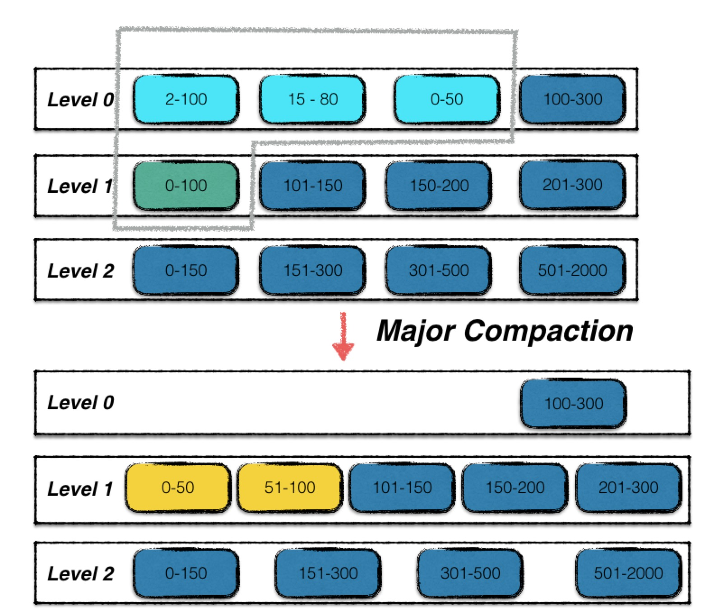

# SST Compaction

- [SST Compaction](#sst-compaction)
  - [什么是`Compact SST`](#什么是compact-sst)
  - [什么时候触发`Compact SST`](#什么时候触发compact-sst)
    - [第一处 读取 Key 的时候](#第一处-读取-key-的时候)
    - [第二处 使用迭代器遍历数据库时](#第二处-使用迭代器遍历数据库时)
    - [第三处 写入 Key 时](#第三处-写入-key-时)
    - [第四处 刚打开数据库时](#第四处-刚打开数据库时)


LevelDB中有两种`Compaction`，一种是`Compact MemTable`，另一种是`Compact SST`。`Compact MemTable`是将`MemTable`落盘为SST文件，`Compact SST`是将多个SST文件合并为一个SST文件。

本章讲述的是`Compact SST`的过程。

## 什么是`Compact SST`

相比于`Compact MemTable`，`Compact SST`复杂的多。首先看一下一次`SST Compaction`的示意图。



Level-0 中浅蓝色的三个 SST 文件，加上 Level-1 中的绿色的 SST 文件，这 4 个文件进行了合并，输出两个新的 SST 文件，替换原有的 SST 文件。

## 什么时候触发`Compact SST`

Compaction 的入口为`MaybeScheduleCompaction()`，`MaybeScheduleCompaction()`里面会判断是需要`Compact SST`还是`Compact MemTable`。

我们来看下有哪些地方调用了`MaybeScheduleCompaction()`。

### 第一处 读取 Key 的时候

我们调用`DBImpl::Get()`读取某个`Key`的时候，LevelDB 会按照`MemTable => Immutable MemTable => SST`的顺序查找，如果在`MemTable`或者`Immutable MemTable`中找到了，那么就不会触发 Compaction。但如果`Key`是在 SST 中找到的，这个 SST 的`allowed_seeks`就会减 1。当`allowed_seeks`为 0 时，就表示这个 SST 需要`Compact`了。

所以在`DBImpl::Get()`中，如果是从 SST 中查找的 Key，就需要调用一下`MaybeScheduleCompaction()`，尝试触发 Compaction。

```cpp
Status DBImpl::Get(const ReadOptions& options, const Slice& key, std::string* value) {
    
    // ...

    bool have_stat_update = false;
    Version::GetStats stats;

    {
        mutex_.Unlock();
        
        LookupKey lkey(key, snapshot);
        if (mem->Get(lkey, value, &s)) {
            // 从 MemTable 中查找成功，
            // 不会触发 Compaction。
        } else if (imm != nullptr && imm->Get(lkey, value, &s)) {
            // 从 Immutable MemTable 中查找成功，
            // 也不会触发 Compaction。
        } else {
            // 如果查找 SST 了，有可能会触发 Compaction，
            s = current->Get(options, lkey, value, &stats);
            have_stat_update = true;
        }
        mutex_.Lock();
    }

    // 如果是从 SST 中查找的 Key，并且该 SST 的 Seek 次数
    // 已经超过了阈值，那么就会触发 Compaction。
    if (have_stat_update && current->UpdateStats(stats)) {
        MaybeScheduleCompaction();
    }
    
    // ...
    return s;
}
```

### 第二处 使用迭代器遍历数据库时

每当调用一次`it->Next()`或者`it->Prev()`移动迭代器时，迭代器内部都会调用一次`DBIter::ParseKey()`，将当前`Key`解析出来。

而在`DBIter::ParseKey()`中，会定期采样当前 Key，看看这个`Key`是否存在于多个`SST`中。如果是的话，就会将这个`Key`所在的`SST`的`allowed_seeks`减 1，然后调用`MaybeScheduleCompaction()`尝试触发 Compaction。

这样做的目的是定期检查`SST`中的`Key`是否存在于多个`SST`中，如果是的话，就通过`Compaction`将这个`Key`所在的`SST`合并到更高 Level 的`SST`中，这样就可以减少`SST`的数量，提高读取效率。

```c++
inline bool DBIter::ParseKey(ParsedInternalKey* ikey) {
    Slice k = iter_->key();

    // 当一个 iterator 已读取的数据大小超过 bytes_until_read_sampling_ 后，
    // 就会用当前 key 采一次样，查看这个 key.user_key 是否存在于多个(两个及以上) SST 
    // 中。如果是的话，就把 key 所在的 SST.allowed_seeks 减 1，然后调用
    // MaybeScheduleCompaction() 尝试触发 Compaction。
    size_t bytes_read = k.size() + iter_->value().size();
    while (bytes_until_read_sampling_ < bytes_read) {
        bytes_until_read_sampling_ += RandomCompactionPeriod();
        db_->RecordReadSample(k);
    }
    assert(bytes_until_read_sampling_ >= bytes_read);
    bytes_until_read_sampling_ -= bytes_read;

    if (!ParseInternalKey(k, ikey)) {
        status_ = Status::Corruption("corrupted internal key in DBIter");
        return false;
    } else {
        return true;
    }
}

void DBImpl::RecordReadSample(Slice key) {
    MutexLock l(&mutex_);
    if (versions_->current()->RecordReadSample(key)) {
        MaybeScheduleCompaction();
    }
}
```

### 第三处 写入 Key 时

写入`Key`(进`MemTable`)之前，会在`DBImpl::MakeRoomForWrite()`里检查`MemTable`是否已满。如果已满，就会调用`MaybeScheduleCompaction()`尝试触发 `Compaction`。此处的`Compaction`指的是`Compact MemTable`，在此就不详细赘述了，忘记的同学可以回头参考[大白话解析LevelDB 2: MemTable 落盘为 SST 文件](https://blog.csdn.net/sinat_38293503/article/details/135662037#Compact_MemTable_12)。

### 第四处 刚打开数据库时

在`DBImpl::Open()`中，会调用`MaybeScheduleCompaction()`尝试触发`Compaction`。

刚打开数据的时候为什么需要尝试触发`Compaction`呢？

因为当数据库上次关闭时，可能还有些没完成的`Compaction`，比如`Compaction`进行中途机器断电了。

所以当数据库打开时，需要尝试触发一次`Compaction`，检查下有没有未完成的`Compaction`。

```c++
Status DB::Open(const Options& options, const std::string& dbname, DB** dbptr) {
    // ...
    // 读取数据库文件，恢复数据库状态。
    Status s = impl->Recover(&edit, &save_manifest);
    // ...
    if (s.ok()) {
        impl->RemoveObsoleteFiles();
        // 当数据库关闭时，可能有些还没完成的 Compaction。
        // 所以打开数据库时尝试触发一次 Compaction，检查
        // 下有没有未完成的 Compaction。
        impl->MaybeScheduleCompaction();
    }
    // ...
    return s;
}
```


