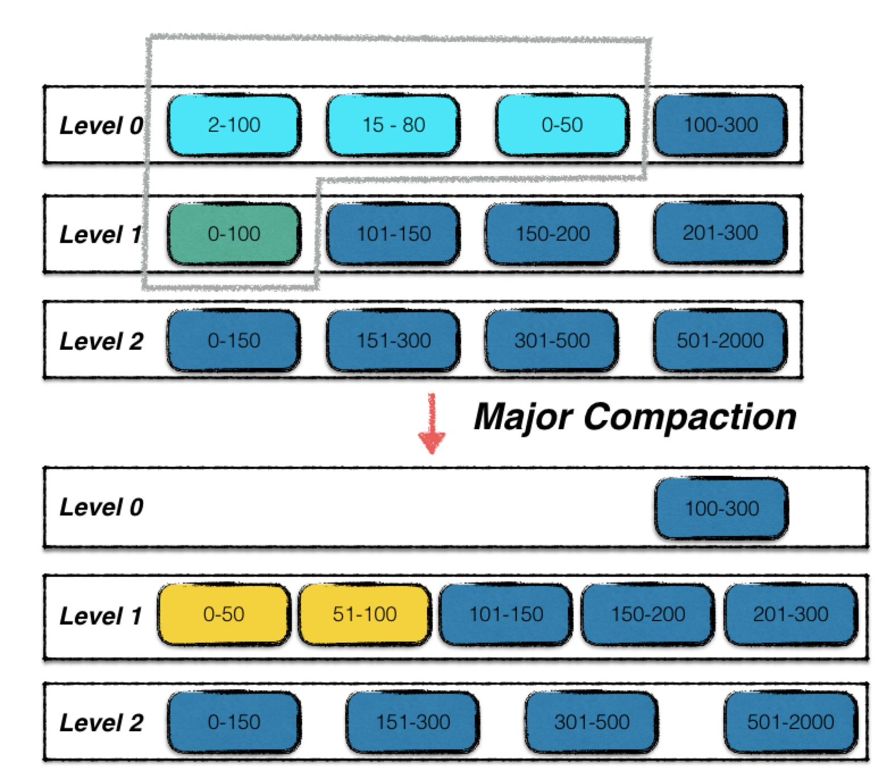

# SST Compaction

- [SST Compaction](#sst-compaction)
  - [什么是`Compact SST`](#什么是compact-sst)
  - [什么时候触发`Compact SST`](#什么时候触发compact-sst)
    - [第一处 读取 Key 的时候](#第一处-读取-key-的时候)
    - [第二处 使用迭代器遍历数据库时](#第二处-使用迭代器遍历数据库时)
    - [第三处 写入 Key 时](#第三处-写入-key-时)
    - [第四处 刚打开数据库时](#第四处-刚打开数据库时)
  - [如何进行`Compact SST`](#如何进行compact-sst)
    - [计算`Compaction`范围](#计算compaction范围)
    - [进行`Compaction`](#进行compaction)
      - [创建一个迭代器用于读取`Compaction`范围内的`Key-Value`](#创建一个迭代器用于读取compaction范围内的key-value)
      - [通过迭代器遍历每个`Key-Value`，丢弃或者写入新的`SST`](#通过迭代器遍历每个key-value丢弃或者写入新的sst)


LevelDB中有两种`Compaction`，一种是`Compact MemTable`，另一种是`Compact SST`。`Compact MemTable`是将`MemTable`落盘为SST文件，`Compact SST`是将多个SST文件合并为一个SST文件。

本章讲述的是`Compact SST`的过程。

## 什么是`Compact SST`

相比于`Compact MemTable`，`Compact SST`复杂的多。首先看一下一次`SST Compaction`的示意图。



Level-0 中浅蓝色的三个 SST 文件，加上 Level-1 中的绿色的 SST 文件，这 4 个文件进行了合并，输出两个新的 SST 文件，替换原有的 SST 文件。

## 什么时候触发`Compact SST`

Compaction 的入口为`MaybeScheduleCompaction()`，`MaybeScheduleCompaction()`里面会判断是需要`Compact SST`还是`Compact MemTable`。

我们来看下有哪些地方调用了`MaybeScheduleCompaction()`。

### 第一处 读取 Key 的时候

我们调用`DBImpl::Get()`读取某个`Key`的时候，LevelDB 会按照`MemTable => Immutable MemTable => SST`的顺序查找，如果在`MemTable`或者`Immutable MemTable`中找到了，那么就不会触发 Compaction。但如果`Key`是在 SST 中找到的，这个 SST 的`allowed_seeks`就会减 1。当`allowed_seeks`为 0 时，就表示这个 SST 需要`Compact`了。

所以在`DBImpl::Get()`中，如果是从 SST 中查找的 Key，就需要调用一下`MaybeScheduleCompaction()`，尝试触发 Compaction。

```cpp
Status DBImpl::Get(const ReadOptions& options, const Slice& key, std::string* value) {
    
    // ...

    bool have_stat_update = false;
    Version::GetStats stats;

    {
        mutex_.Unlock();
        
        LookupKey lkey(key, snapshot);
        if (mem->Get(lkey, value, &s)) {
            // 从 MemTable 中查找成功，
            // 不会触发 Compaction。
        } else if (imm != nullptr && imm->Get(lkey, value, &s)) {
            // 从 Immutable MemTable 中查找成功，
            // 也不会触发 Compaction。
        } else {
            // 如果查找 SST 了，有可能会触发 Compaction，
            s = current->Get(options, lkey, value, &stats);
            have_stat_update = true;
        }
        mutex_.Lock();
    }

    // 如果是从 SST 中查找的 Key，并且该 SST 的 Seek 次数
    // 已经超过了阈值，那么就会触发 Compaction。
    if (have_stat_update && current->UpdateStats(stats)) {
        MaybeScheduleCompaction();
    }
    
    // ...
    return s;
}
```

### 第二处 使用迭代器遍历数据库时

每当调用一次`it->Next()`或者`it->Prev()`移动迭代器时，迭代器内部都会调用一次`DBIter::ParseKey()`，将当前`Key`解析出来。

而在`DBIter::ParseKey()`中，会定期采样当前 Key，看看这个`Key`是否存在于多个`SST`中。如果是的话，就会将这个`Key`所在的`SST`的`allowed_seeks`减 1，然后调用`MaybeScheduleCompaction()`尝试触发 Compaction。

这样做的目的是定期检查`SST`中的`Key`是否存在于多个`SST`中，如果是的话，就通过`Compaction`将这个`Key`所在的`SST`合并到更高 Level 的`SST`中，这样就可以减少`SST`的数量，提高读取效率。

```cpp
inline bool DBIter::ParseKey(ParsedInternalKey* ikey) {
    Slice k = iter_->key();

    // 当一个 iterator 已读取的数据大小超过 bytes_until_read_sampling_ 后，
    // 就会用当前 key 采一次样，查看这个 key.user_key 是否存在于多个(两个及以上) SST 
    // 中。如果是的话，就把 key 所在的 SST.allowed_seeks 减 1，然后调用
    // MaybeScheduleCompaction() 尝试触发 Compaction。
    size_t bytes_read = k.size() + iter_->value().size();
    while (bytes_until_read_sampling_ < bytes_read) {
        bytes_until_read_sampling_ += RandomCompactionPeriod();
        db_->RecordReadSample(k);
    }
    assert(bytes_until_read_sampling_ >= bytes_read);
    bytes_until_read_sampling_ -= bytes_read;

    if (!ParseInternalKey(k, ikey)) {
        status_ = Status::Corruption("corrupted internal key in DBIter");
        return false;
    } else {
        return true;
    }
}

void DBImpl::RecordReadSample(Slice key) {
    MutexLock l(&mutex_);
    if (versions_->current()->RecordReadSample(key)) {
        MaybeScheduleCompaction();
    }
}
```

### 第三处 写入 Key 时

写入`Key`(进`MemTable`)之前，会在`DBImpl::MakeRoomForWrite()`里检查`MemTable`是否已满。如果已满，就会调用`MaybeScheduleCompaction()`尝试触发 `Compaction`。此处的`Compaction`指的是`Compact MemTable`，在此就不详细赘述了，忘记的同学可以回头参考[大白话解析LevelDB 2: MemTable 落盘为 SST 文件](https://blog.csdn.net/sinat_38293503/article/details/135662037#Compact_MemTable_12)。

### 第四处 刚打开数据库时

在`DBImpl::Open()`中，会调用`MaybeScheduleCompaction()`尝试触发`Compaction`。

刚打开数据的时候为什么需要尝试触发`Compaction`呢？

因为当数据库上次关闭时，可能还有些没完成的`Compaction`，比如`Compaction`进行中途机器断电了。

所以当数据库打开时，需要尝试触发一次`Compaction`，检查下有没有未完成的`Compaction`。

```cpp
Status DB::Open(const Options& options, const std::string& dbname, DB** dbptr) {
    // ...
    // 读取数据库文件，恢复数据库状态。
    Status s = impl->Recover(&edit, &save_manifest);
    // ...
    if (s.ok()) {
        impl->RemoveObsoleteFiles();
        // 当数据库关闭时，可能有些还没完成的 Compaction。
        // 所以打开数据库时尝试触发一次 Compaction，检查
        // 下有没有未完成的 Compaction。
        impl->MaybeScheduleCompaction();
    }
    // ...
    return s;
}
```

## 如何进行`Compact SST`

在`MaybeScheduleCompaction()`中，会通过`versions_->NeedsCompaction()`判断是否满足`Compaction`条件。

若条件满足，会将`background_compaction_scheduled_`标志位设置为`true`，然后将`DBImpl::BGWork()`加入线程池中，在后台线程中进行`Compaction`。

```cpp
void DBImpl::MaybeScheduleCompaction() {
    mutex_.AssertHeld();
    if (background_compaction_scheduled_) {
        // 已经有 Compaction 在后台线程中执行了。
    } else if (shutting_down_.load(std::memory_order_acquire)) {
        // 数据库正在被关闭，不再进行 Compaction。
    } else if (!bg_error_.ok()) {
        // 存在错误，不再进行 Compaction。
    } else if (imm_ == nullptr && manual_compaction_ == nullptr && !versions_->NeedsCompaction()) {
        // 不满足 Compaction 条件
    } else {
        // 满足 Compaction 条件，把 Compaction Job 加入到后台线程池中。
        background_compaction_scheduled_ = true;
        env_->Schedule(&DBImpl::BGWork, this);
    }
}
```

`DBImpl::BGWork()`只是层包装，最终会调用到`DBImpl::BackgroundCompaction()`，也就是`Compaction`的实现函数。

`DBImpl::BackgroundCompaction()`里先计算出本次`Compaction`的范围，然后调用`DoCompactionWork()`进行`Compaction`。

```cpp
void DBImpl::BackgroundCompaction() {
    mutex_.AssertHeld();

    // 先判断是否存在 Immutable MemTable，如果存在，
    // 就将本次 Compaction 判定为 MemTable Compaction。
    if (imm_ != nullptr) {
        CompactMemTable();
        return;
    }

    // 否则为判定为 SST Compaction，进入 SST Compaction 的流程。

    Compaction* c;

    bool is_manual = (manual_compaction_ != nullptr);
    InternalKey manual_end;

    // 如果是用户主动发起的手动 Compaction，本次 Compaction 的范围
    // 是由用户指定的，需要从 manual_compaction_ 中读取，而不是由 LevelDB 计算得出。
    // 否则，本次 Compaction 的范围由`PickCompaction()`计算得出。
    // 无论是手动 Compaction 还是自动 Compaction，最终都会把 Compaction 所
    // 涉及的 SST 文件编号记录到`Compaction* c`对象中。
    //    c->inputs_[0] 中存放的是 Compaction Level 所涉及的 SST 文件编号。
    //    c->inputs_[1] 中存放的是 Compaction Level+1 所涉及的 SST 文件编号。
    if (is_manual) {
        ManualCompaction* m = manual_compaction_;
        c = versions_->CompactRange(m->level, m->begin, m->end);
        m->done = (c == nullptr);
        if (c != nullptr) {
            manual_end = c->input(0, c->num_input_files(0) - 1)->largest;
        }
        Log(options_.info_log, "Manual compaction at level-%d from %s .. %s; will stop at %s\n",
            m->level, (m->begin ? m->begin->DebugString().c_str() : "(begin)"),
            (m->end ? m->end->DebugString().c_str() : "(end)"),
            (m->done ? "(end)" : manual_end.DebugString().c_str()));
    } else {
        //  由 leveldb 计算 Compaction 范围
        c = versions_->PickCompaction();
    }

    Status status;
    if (c == nullptr) {
        // 经过上面的计算，发现本次 Compaction 不需要进行，直接返回。
    } else if (!is_manual && c->IsTrivialMove()) {
        // IsTrivialMove() 表示本次 Compaction 只需要简单地将 SST 文件从
        // level 层移动到 level+1 层即可，不需要进行 SST 文件合并。

        // 在 TrivialMove 的情况下，level 层需要 Compaction 的 SST 文件
        // 只能有一个。
        assert(c->num_input_files(0) == 1);

        // 获取 level 层需要 Compaction 的第 0 个 SST 文件的元数据信息。 
        FileMetaData* f = c->input(0, 0);

        // 编辑 VersionEdit，将 level 层需要 Compact 的 SST 从 level 层移除，
        // 并将其添加到 level+1 层。
        c->edit()->RemoveFile(c->level(), f->number);
        c->edit()->AddFile(c->level() + 1, f->number, f->file_size, f->smallest, f->largest);

        // Apply 该 VersionEdit，将其应用到当前 VersionSet 中。
        status = versions_->LogAndApply(c->edit(), &mutex_);
        if (!status.ok()) {
            RecordBackgroundError(status);
        }
        VersionSet::LevelSummaryStorage tmp;
        Log(options_.info_log, "Moved #%lld to level-%d %lld bytes %s: %s\n",
            static_cast<unsigned long long>(f->number), c->level() + 1,
            static_cast<unsigned long long>(f->file_size), status.ToString().c_str(),
            versions_->LevelSummary(&tmp));
    } else {
        // 需要进行 SST 文件合并的 Compaction。

        // 构造一个 CompactionState 对象，用于记录本次 Compaction 
        // 需要新生成的 SST 信息。
        CompactionState* compact = new CompactionState(c);

        // 进行真正的 SST Compaction 操作，将 Compaction SST
        // 文件合并生成新的 SST 文件。
        status = DoCompactionWork(compact);
        if (!status.ok()) {
            RecordBackgroundError(status);
        }

        // Compaction 结束后的清理工作工作。
        CleanupCompaction(compact);

        // Compaction 完成后，Input Version 就不再需要了，将其释放。
        c->ReleaseInputs();

        // 移除数据库中不再需要的文件。
        RemoveObsoleteFiles();
    }
    delete c;

    if (status.ok()) {
        // 没有异常，不需要进行任何异常处理。
    } else if (shutting_down_.load(std::memory_order_acquire)) {
        // 如果当前正在关闭数据库，那错误就先不需要处理了，留到下次打开
        // 数据时再处理，先以最快的时间关闭数据库。
    } else {
        Log(options_.info_log, "Compaction error: %s", status.ToString().c_str());
    }

    if (is_manual) {
        ManualCompaction* m = manual_compaction_;
        if (!status.ok()) {
            // Compaction 失败了，需要把 m->done 标记为 true，
            // 防止重复 Compact 该范围。
            m->done = true;
        }
        if (!m->done) {
            // Compaction 完成，需要把 m->begin 更新为本次
            // Compaction 的结尾，以便下次继续 Compact。
            m->tmp_storage = manual_end;
            m->begin = &m->tmp_storage;
        }
        manual_compaction_ = nullptr;
    }
}
```

### 计算`Compaction`范围

1. 如果是手动触发的`Compaction`，那么初始范围由用户指定，最终通过`versions_->CompactRange()`计算出`Compaction`的范围。
2. 如果是自动触发的`Compaction`，那么最终通过`versions_->PickCompaction()`计算出`Compaction`的范围。

`versions_->CompactRange()`的实现可移步参考[大白话解析LevelDB: VersionSet](https://blog.csdn.net/sinat_38293503/article/details/135661973#Compaction_VersionSetCompactRangeint_level_const_InternalKey_begin_const_InternalKey_end_932)
`versions_->PickCompaction()`的实现可移步参考[大白话解析LevelDB: VersionSet](https://blog.csdn.net/sinat_38293503/article/details/135661973#Compaction_VersionSetPickCompaction_745)

### 进行`Compaction`

1. 如果计算出的`Compaction`范围是`nullptr`，表示当前不需要进行`Compaction`，直接返回。
2. 如果计算出的`Compaction`范围符合`TrivialMove`条件，表示只需要将`SST`文件从`level`层移动到`level+1`层即可，不需要进行`SST`文件合并。
3. 否则的话，就需要进行`SST`文件合并，`DoCompactionWork(c)`将`Compaction`范围内的`SST`文件合并为一个新的`SST`文件。

`DoCompactionWork(CompactionState* compact)`的实现如下。

```cpp
Status DBImpl::DoCompactionWork(CompactionState* compact) {
    const uint64_t start_micros = env_->NowMicros();
    int64_t imm_micros = 0;  // Micros spent doing imm_ compactions

    Log(options_.info_log, "Compacting %d@%d + %d@%d files",
        compact->compaction->num_input_files(0), compact->compaction->level(),
        compact->compaction->num_input_files(1), compact->compaction->level() + 1);

    assert(versions_->NumLevelFiles(compact->compaction->level()) > 0);
    assert(compact->builder == nullptr);
    assert(compact->outfile == nullptr);
    // 将当前存活着的最小 snapshot 版本号记录到`compact->smallest_snapshot`中。
    // Compaction 的时候会将 Sequence Number 小于`compact->smallest_snapshot`的
    // Key 都扔掉，因为已经没有 snapshot 需要这些 Key 了。
    if (snapshots_.empty()) {
        compact->smallest_snapshot = versions_->LastSequence();
    } else {
        compact->smallest_snapshot = snapshots_.oldest()->sequence_number();
    }

    // 创建一个 Iterator 来读取所有的 Compaction SST。
    Iterator* input = versions_->MakeInputIterator(compact->compaction);

    // 开始 Compaction，在这期间可以先释放 mutex_，让其他线程可以继续读写数据库。
    mutex_.Unlock();

    input->SeekToFirst();
    Status status;
    ParsedInternalKey ikey;
    std::string current_user_key;
    bool has_current_user_key = false;
    SequenceNumber last_sequence_for_key = kMaxSequenceNumber;
    // Compaction 的过程会比较耗时，每处理完一个 Key 就检查下是否正在关闭数据库。
    // 如果检查到正在关闭数据库，就先终止 Compaction，等下次打开数据库的时候再继续 Compaction。
    while (input->Valid() && !shutting_down_.load(std::memory_order_acquire)) {
        // 如果检测到有 Immutable MemTable 存在，优先处理 Immutable MemTable，
        // 把 Immutable MemTable 转成 SST 文件。
        if (has_imm_.load(std::memory_order_relaxed)) {
            const uint64_t imm_start = env_->NowMicros();
            mutex_.Lock();
            if (imm_ != nullptr) {
                CompactMemTable();
                // Compact MemTable 完成后唤醒在`MakeRoomForWrite()`中等待的线程。
                background_work_finished_signal_.SignalAll();
            }
            mutex_.Unlock();
            imm_micros += (env_->NowMicros() - imm_start);
        }

        Slice key = input->key();
        // 检查本次 Compaction 的范围是否太大，如果太大的话就缩小本次的 Compaction 范围，
        // Compact 到 key 为止即可，后面的 key 等下次 Compaction 的时候再处理。
        if (compact->compaction->ShouldStopBefore(key) && compact->builder != nullptr) {
            status = FinishCompactionOutputFile(compact, input);
            if (!status.ok()) {
                break;
            }
        }

        bool drop = false;
        if (!ParseInternalKey(key, &ikey)) {
            // 如果解析 Key 失败，那可能是数据损坏的情况。
            // 把坏掉的 Key 保留下来，写到新 SST 里，让用户
            // 来处理。
            current_user_key.clear();
            has_current_user_key = false;
            last_sequence_for_key = kMaxSequenceNumber;
        } else {
            if (!has_current_user_key ||
                user_comparator()->Compare(ikey.user_key, Slice(current_user_key)) != 0) {
                
                current_user_key.assign(ikey.user_key.data(), ikey.user_key.size());
                has_current_user_key = true;
                last_sequence_for_key = kMaxSequenceNumber;
            }

            // 当 key 的类型为 Deletion 时，
            // 或者 key 的 Sequence Number 小于 compact->smallest_snapshot，
            // 这个 key 就会被丢弃。
            // 举个例子:
            //    compact->smallest_snapshot = 4
            //    读到的 key 为: key1-seq5, key1-seq4, key1-seq3, key1-seq2, key1-seq1。
            //    key1-seq5 和 key1-seq4 会被保留写入到新 SST 中，
            //    剩下的 key1-seq3, key1-seq2, key1-seq1 都会被丢弃。
            if (last_sequence_for_key <= compact->smallest_snapshot) {
                // Hidden by an newer entry for same user key
                drop = true;  // (A)
            } else if (ikey.type == kTypeDeletion && ikey.sequence <= compact->smallest_snapshot &&
                       compact->compaction->IsBaseLevelForKey(ikey.user_key)) {
                drop = true;
            }

            last_sequence_for_key = ikey.sequence;
        }
#if 0
    Log(options_.info_log,
        "  Compact: %s, seq %d, type: %d %d, drop: %d, is_base: %d, "
        "%d smallest_snapshot: %d",
        ikey.user_key.ToString().c_str(),
        (int)ikey.sequence, ikey.type, kTypeValue, drop,
        compact->compaction->IsBaseLevelForKey(ikey.user_key),
        (int)last_sequence_for_key, (int)compact->smallest_snapshot);
#endif

        // 如果当前 key 不需要被丢弃，就把它写入到新的 SST 中。
        if (!drop) {
            // 如果当前没有打开的 Output SST 文件，就打开一个新的 Output SST 文件。
            // 通过 compact->builder 来控制该新 SST 文件的写入。
            if (compact->builder == nullptr) {
                status = OpenCompactionOutputFile(compact);
                if (!status.ok()) {
                    break;
                }
            }

            // 设置这个 Output SST 文件的最小 key 和最大 key。
            if (compact->builder->NumEntries() == 0) {
                compact->current_output()->smallest.DecodeFrom(key);
            }
            compact->current_output()->largest.DecodeFrom(key);

            // 往新 SST 中写入当前的 Key-Value。
            compact->builder->Add(key, input->value());

            // Output SST 大小达到了阈值，就完成该 Ouput SST 的构建，重新开一个新的 SST。
            if (compact->builder->FileSize() >= compact->compaction->MaxOutputFileSize()) {
                status = FinishCompactionOutputFile(compact, input);
                if (!status.ok()) {
                    break;
                }
            }
        }

        input->Next();
    }

    // Compaction 和关闭数据库撞上了，终止 Compaction。
    if (status.ok() && shutting_down_.load(std::memory_order_acquire)) {
        status = Status::IOError("Deleting DB during compaction");
    }
    // 如果还有没收尾的 SST，做个收尾。
    if (status.ok() && compact->builder != nullptr) {
        status = FinishCompactionOutputFile(compact, input);
    }
    // 检查 input 迭代器有木有错误。
    if (status.ok()) {
        status = input->status();
    }
    delete input;
    input = nullptr;

    // 记录下本次 Compaction 所花费的时间。
    CompactionStats stats;
    stats.micros = env_->NowMicros() - start_micros - imm_micros;

    // 记录下本次 Compaction 一共读取了多少字节。
    for (int which = 0; which < 2; which++) {
        for (int i = 0; i < compact->compaction->num_input_files(which); i++) {
            stats.bytes_read += compact->compaction->input(which, i)->file_size;
        }
    }

    // 记录本次 Compaction 一共写入了多少字节。
    for (size_t i = 0; i < compact->outputs.size(); i++) {
        stats.bytes_written += compact->outputs[i].file_size;
    }

    mutex_.Lock();
    // 记录本次 Compaction 被推到哪个 level.
    stats_[compact->compaction->level() + 1].Add(stats);

    // 将本次 Compaction 产生的改动(删除和新增了哪些 SST)生成一个 VersionEdit，
    // 并应用到最新的 Version 上，产生一个新的 Version。
    if (status.ok()) {
        status = InstallCompactionResults(compact);
    }
    if (!status.ok()) {
        RecordBackgroundError(status);
    }
    VersionSet::LevelSummaryStorage tmp;
    Log(options_.info_log, "compacted to: %s", versions_->LevelSummary(&tmp));
    return status;
}
```

#### 创建一个迭代器用于读取`Compaction`范围内的`Key-Value`

通过`Iterator* input = versions_->MakeInputIterator(compact->compaction)`创建一个迭代器，该迭代器可按顺序读取`Compaction`范围所有内的`Key-Value`。

#### 通过迭代器遍历每个`Key-Value`，丢弃或者写入新的`SST`

leveldb 会先读取当前最小的`Snapshot`版本号，记录到`compact->smallest_snapshot`中。

如果当前`Key`的版本号小于`compact->smallest_snapshot`，或者`Key`的类型为`Deletion`，那么这个`Key`就会被丢弃。

否则的话，将当前`Key`写入新的`SST`。


