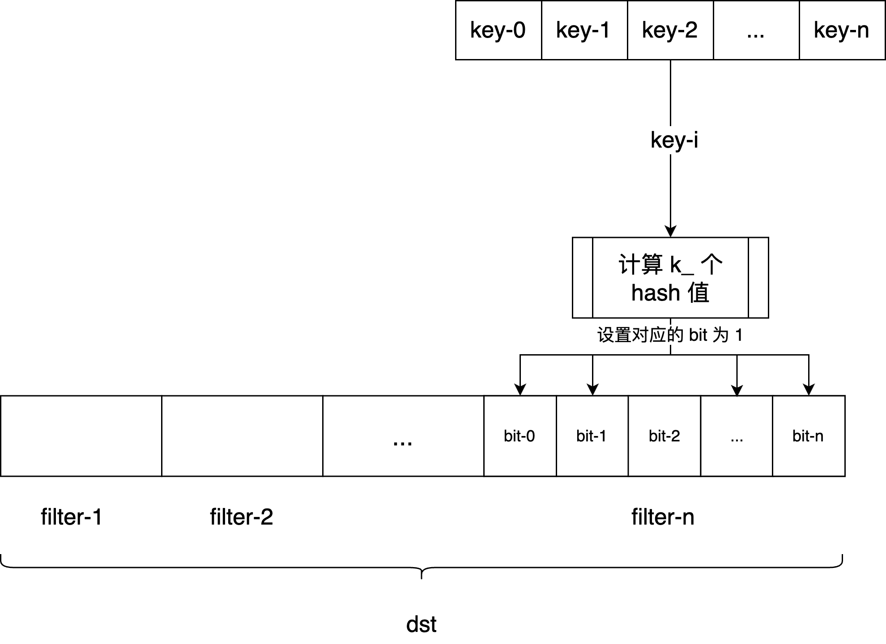

# FilterPolicy 

FilterPolicy 是一个接口类，定义了两个方法：

- `CreateFilter(const Slice* keys, int n, std::string* dst)`：为 keys 中的所有 key 创建一个 filter，将 filter 编码后压入 dst 里。
- `KeyMayMatch(const Slice& key, const Slice& filter)`：判断 key 是否在 filter 中。

```c++
// Filter 接口类，只有两个方法：
class LEVELDB_EXPORT FilterPolicy {
   public:
    virtual ~FilterPolicy();

    // 为了判断 encode 时使用的 filter 与 decode 时使用的 filter 是否一致，
    // 需要为 filter 设置一个名字，通过名字来区分是否是同种类的 filter。
    virtual const char* Name() const = 0;

    // 为 keys 中的所有 key 创建一个 filter，将 filter 编码后压入 dst 里。
    virtual void CreateFilter(const Slice* keys, int n, std::string* dst) const = 0;

    // 判断 key 是否在 filter 中。
    virtual bool KeyMayMatch(const Slice& key, const Slice& filter) const = 0;
};
```

## BloomFilterPolicy

LevelDB 中提供了一个 BloomFilterPolicy，以[布隆过滤器](https://zh.wikipedia.org/wiki/%E5%B8%83%E9%9A%86%E8%BF%87%E6%BB%A4%E5%99%A8)的方式实现了 FilterPolicy 接口。

```c++
class BloomFilterPolicy : public FilterPolicy {
   public:
    explicit BloomFilterPolicy(int bits_per_key) : bits_per_key_(bits_per_key) {
        // k_ 表示 Bloom Filter 使用的 hash 函数个数。
        // 要使得 Bloom Filter 的误判率最小，k_的计算方法为:
        // k_ = (size_of_bloom_filter_in_bits/number_of_keys) * ln(2)，
        // 也就是 k_ = bits_per_key * ln(2)。
        k_ = static_cast<size_t>(bits_per_key * 0.69);  // 0.69 =~ ln(2)
        if (k_ < 1) k_ = 1;
        if (k_ > 30) k_ = 30;
    }

    const char* Name() const override { return "leveldb.BuiltinBloomFilter2"; }

    void CreateFilter(const Slice* keys, int n, std::string* dst) const override;

    bool KeyMayMatch(const Slice& key, const Slice& bloom_filter) const override;

   private:
    size_t bits_per_key_; // 每个 key 占用的 bit 数
    size_t k_; // BloomFilter 使用的 hash 函数个数
};
```

### BloomFilterPolicy::CreateFilter(const Slice* keys, int n, std::string* dst)

为 keys 中的所有 key 创建一个 BloomFilter，将该 filter 编码后压入 dst 里。



```c++
void CreateFilter(const Slice* keys, int n, std::string* dst) const override {
    // 计算 Bloom Filter 的大小，
    // bits = key 的数量 * 每个 key 占用的 bit 数
    size_t bits = n * bits_per_key_;

    // 当 n 太小的时候，计算出来的 bits 太小会导致 Bloom Filter 的误判率很高，
    // 所以这里设置一个最小值 64。
    if (bits < 64) bits = 64;

    // 根据 bits 计算出 bytes，再反算 bits。
    // bytes = (bits + 7) / 8 表示 bits/8 向上取整。
    size_t bytes = (bits + 7) / 8;
    bits = bytes * 8;

    // dst 里可能已经有其他 fitler 了，先将 dst 的容量扩大 bytes，
    // 把当前 filter 的空间给创建出来。
    const size_t init_size = dst->size();
    dst->resize(init_size + bytes, 0);
    // 在 filter 的末尾压入 k_，以供 KeyMayMatch 解码 filter 的时候使用。
    dst->push_back(static_cast<char>(k_));  // Remember # of probes in filter
    // 获取当前 BloomFilter 在 dst 中的起始位置。
    char* array = &(*dst)[init_size];
    for (int i = 0; i < n; i++) {
        // 使用 double-hashing 来计算每个 key 的 hash 值。
        // double-hashing 是一种优秀的 hash 实现算法，
        // 能够在输入不均匀分布的情况下，提供均匀分布的 hash。
        // double-hashing 的详情可见原文: https://www.eecs.harvard.edu/~michaelm/postscripts/rsa2008.pdf
        uint32_t h = BloomHash(keys[i]);
        const uint32_t delta = (h >> 17) | (h << 15);  // Rotate right 17 bits
        for (size_t j = 0; j < k_; j++) {
            const uint32_t bitpos = h % bits;
            // 设置 Bloom Filter 中对应的 bit 位为 1。
            array[bitpos / 8] |= (1 << (bitpos % 8));
            h += delta;
        }
    }
}
```

### BloomFilterPolicy::KeyMayMatch(const Slice& key, const Slice& bloom_filter)

给定一个`BloomFilterPolicy::CreateFilter`创建出来的`bloom_filter`，判断一个`key`是否在`bloom_filter`中。

```c++
bool KeyMayMatch(const Slice& key, const Slice& bloom_filter) const override {
    // len 为该 bloom_filter 的长度，bit 数。
    const size_t len = bloom_filter.size();
    // 当 bloom_filter 的长度小于 2 时，该 bloom_filter 是无效的。
    if (len < 2) return false;

    const char* array = bloom_filter.data();
    // len - 1 是因为 array 里的最后一个字节是 k_。
    const size_t bits = (len - 1) * 8;

    // 取出该 bloom_filter 的 k_ 值，以供解码 bloom_filter 使用。
    const size_t k = array[len - 1];
    if (k > 30) {
        // 当前版本的 bloom_filter 不支持 k_ > 30，但是未来可能会支持。
        // 如果用老版本的 bloom_filter 解析未来新版的 bloom_filter，
        // 则直接返回 true，当成是 false-positive 的情况。
        return true;
    }

    // 用与 CreateFilter 同样的 double-hashing 算法计算出 key 的 hash 值，
    // 检查对应的 bit 是否都为 1。
    uint32_t h = BloomHash(key);
    const uint32_t delta = (h >> 17) | (h << 15);  // Rotate right 17 bits
    for (size_t j = 0; j < k; j++) {
        const uint32_t bitpos = h % bits;
        if ((array[bitpos / 8] & (1 << (bitpos % 8))) == 0) return false;
        h += delta;
    }
    return true;
}
```