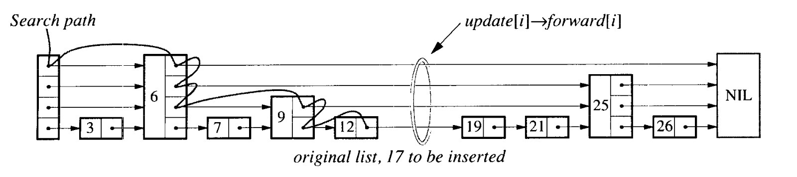

# SkipList

## 什么是SkipList(跳表)

跳表是有序集合的一种实现, 本质是一个有序链表。

在c++的标准库中, 我们经常会用到`std::set`和`std::map`。这两个容器都是有序集合/有序字典, 但是它们的底层实现是`RBTree`(红黑树).
`RBTree`, `SkipList`, `B+Tree`都是有序集合的实现.

`SkipList`的增删改查的时间复杂度都是O(logn), 与`RBTree`相同, 但是`SkipList`的实现比`RBTree`简单得多.

## 为什么使用skiplist

SkipList（跳表）、Red-Black Tree（红黑树）和 B+ Tree 都是常用的数据结构，各自具有不同的特点和优势。以下是 SkipList 与 Red-Black Tree 和 B+ Tree 相比的一些优势：

### SkipList 与 Red-Black Tree（红黑树）相比的优势：

1. **简单性**：
   - SkipList 的算法和数据结构比 Red-Black Tree 简单得多，容易理解和实现。对于一些应用场景来说，这使得 SkipList 更易于维护和调试。

2. **并行和锁定**：
   - 在并发环境中，Skip List 通常更容易实现有效的锁定策略。由于其层级结构，可以更灵活地控制锁的粒度，从而在并发操作中表现更好。

3. **顺序访问**：
   - SkipList 对顺序访问（例如范围查询）非常友好，因为它基于链表实现。

### SkipList 与 B+ Tree 相比的优势：

1. **实现复杂性**：
   - SkipList 在实现上通常比 B+ Tree 简单。B+ Tree 的节点分裂和合并操作相对复杂，而 SkipList 的插入和删除操作更直接。

2. **内存使用**：
   - 对于内存中的数据结构，Skip List 可能比 B+ Tree 更高效，因为它不需要预先分配固定大小的节点。Skip List 的节点大小可以根据实际需求动态变化。

3. **动态操作**：
   - SkipList 更适合动态数据集，其中数据项频繁插入和删除，因为 SkipList 不需要复杂的重平衡操作。

### 综合考虑：

当考虑使用 Skip List、Red-Black Tree 或 B+ Tree 时，应根据具体应用场景的需求来选择。

- 适合使用SkipList: 如果需要在`内存中`快速处理动态数据集，并且`开发时间有限`.
- 适合使用B+Tree: 需要高效`磁盘存储`和范围查询的场景，B+Tree 更为适合。
- 适合使用使用RBTree: 需要严格平衡的场景，以保证操作的`最坏情况性能`。

## SkipList的原理

以论文中的skiplist示意图为例, 我们举例说明skiplist的原理.



从图中我们可以看到, skiplist的本质是个多层的有序链表, 每一层都是一条单链表, 并且上层是下层的子集.

## SkipList查找操作

### 查找过程

首先我们来看一下查找操作, 假设我们现在要查找一个值为`12`的节点.

1. 一共有`4`层链表, 从`DummyHead`的最高层`DummyHead[3]`开始, `DummyHead[3]->next`为`Node6`, 比`12`小, 所以将当前指针指向`Node6[3]`.
2. 继续再看`Node6[3]->next`, 为`Null`, `Null`视为无限大节点, 比`12`大, 所以我们不能将当前指针移向`Node6[3]->next`. 此时需要降一层, 来看下一层的`Node6[2]->next`.
3. `Node6[2]->next`为`Node25`, 比`12`大, 继续降一层.
4. `Node6[1]->next`为`Node9`, 比`12`小了, 可以往后移了, 将当前指针移向`Node9[1]`.
5. `Node9[1]->next`为`Node25`, 比`12`大, 不能往后移, 降一层.
6. `Node9[0]->next`为`Node12`, 找到了, 返回`Node12`.

### 查找开销

我们可以看到, 在`SkipList`中查找一个元素的过层, 是一个近似二分查找的过程. 那具体的时间复杂度是多少呢?

决定`SkipList`查找性能的因子有两个: 

- 最大层高`h`. `h`代表了`SkipList`的最大层高, `h`越大, 性能越好, 空间开销越大.
- 概率因子`p`. `p`表示上层节点数与下层节点数的比例, `p`越接近0.5, 性能越好. 当`p=0.5`时, 就是二分查找.

`SkipList`的平均查找时间复杂度是$O(\log_{1/p} n)$。其中$p$表示上层节点数与下层节点数的比例, $n$为节点总数。

#### $h$（最大层高）的影响

- 性能: $h$越大，意味着SkipList的层数越多，能够加快查找速度，但垂直移动的步数可能会增加。
- 空间: 增加$h$会导致空间复杂度上升，因为需要更多的指针来维持更多的层。

#### $p$（概率因子）的影响

- 性能: $p$决定了节点在上层出现的概率，影响了水平跳跃的步数。$p$值越大，每一层的节点数越少，平均查找步数越小。
- 空间: $p$值较小会导致更多的层，这会增加空间复杂度。

选择合适的$h$和$p$取决于特定应用的性能要求和可用空间。通常，$h$会选择为$\log_{1/p} n$或稍微高一点，而$p$的常见值为0.5，但可以根据具体的使用场景进行调整。

#### 时间复杂度推导过程

要推导跳表（Skip List）查找操作的时间复杂度，我们首先需要理解跳表的基本属性和结构。给定跳表的高度为 $h$，随机因子为 $p$（表示节点在更高层出现的概率，即高层节点数量是低层节点数量的 $\frac{1}{p}$），和节点总数为 $n$，我们可以按照以下步骤进行推导：

**1. 层级与节点分布**  
由于每个节点在每一层出现的概率是 $p$，因此第 $i$ 层大约有 $n \cdot p^i$ 个节点（假设底层为第 0 层，有 $n$ 个节点）。

**2. 跨越节点的步数**  
在每一层，我们期望在转到下一层之前进行大约 $\frac{1}{p}$ 步跳跃，因为每个节点都有 $p$ 的概率出现在下一层。

**3. 层级高度的确定**  
高度 $h$ 可以根据 $n$ 来确定，以保证跳表的效率。一般来说，高度 $h$ 大约是 $\log_{\frac{1}{p}} n$。

**4. 查找操作的步骤分析**  
查找操作从最顶层开始，然后在每一层大约进行 $\frac{1}{p}$ 步跳跃，然后下降到下一层继续搜索。

**5. 时间复杂度推导**  
由于在每一层我们都会进行大约 $\frac{1}{p}$ 步操作，且总共有 $h$ 层，所以总的步骤数是 $h \cdot \frac{1}{p}$。将 $h$ 替换为 $\log_{\frac{1}{p}} n$，我们得到总步骤数为 $\frac{1}{p} \cdot \log_{\frac{1}{p}} n$。

**6. 最终时间复杂度**  
因此，跳表的查找操作的时间复杂度是 $O\left(\frac{1}{p} \cdot \log_{\frac{1}{p}} n\right)$。考虑到 $\log_{\frac{1}{p}} n$ 是 $\log n$ 的常数倍，我们通常将时间复杂度简化为 $O(\log n)$。

**总结**  
跳表的查找操作时间复杂度的推导基于层级结构和随机层级分配的概率性。每层的跳跃步数乘以层的总数给出了整个查找操作的总步骤数，从而得到了查找操作的时间复杂度。


## SkipList插入操作

### 插入过程

理解`SkipList`的查找节点操作后, 添加一个节点就很简单了.

找到节点的插入位置, 具体的说, 找到新增节点的前驱节点, 即最大的小于等于新增节点的节点.

比如对于图中的`SkipList`说, 新增节点`17`的前驱节点就是`12`.


找到前驱节点后, 将构造好的新增节点插入到前驱节点后面即可, 这和单层有序链表的插入操作是一样的, 只不过有很多个`next`指针而已.

重点在于构造新节点的时候, 如何确定新节点的层数? 这里就是`SkipList`的精髓所在了.

`SkipList`中确定新节点层数的过程通常是随机化的，基于一定的概率因子 `p`（通常取值为0.5或其他小于1的数）.

确定新节点层数的过程：

1. **开始于最低层**：新节点至少会出现在第一层, 也就是从第一层开始抛硬币.
2. **抛硬币**：对于每一层，你可以想象自己在做一个“抛硬币”的实验，如果硬币正面朝上（这个事件发生的概率为 `p`），新节点的层数就会`+1`.
3. **重复抛硬币直到失败**：重复这个随机过程直到硬币背面朝上为止（即事件发生的概率为 `1 - p`）, 此时抛硬币过程结束, 新节点层数计算完成.
4. **限制最大层数**：`SkipList`通常有一个预设的最大层数 `MaxLevel`，节点的层数不会超过这个值.若抛硬币一直抛到第 `MaxLevel` 层，还是正面朝上，也不会再继续增加层数了.

### 插入开销

$$插入节点的开销 = 查找节点的开销(O(\log_{1/p} n)) + 抛硬币的开销(O(\log_{1/p} n)) + 将节点插入链表的开销(O(\log_{1/p} n)) = O(\log_{1/p} n)$$

## SkipList删除操作

### 删除过程

找到前驱节点, 将前驱节点的`next`指针指向待删除节点的`next`指针即可, 思路和单链表的删除操作是一样的.

### 删除开销

于插入开销一样, $O(\log_{1/p} n))$

## LevelDB中SkipList的实现

老规矩, 先看一下`LevelDB`中`SkipList`的定义:

```cpp
template <typename Key, class Comparator>
class SkipList {
   private:
    // 先声明一下Node, 把Node的定义放在后面
    // 以保证代码的简洁
    struct Node; 

   public:
    // cmp用于比较两个key的大小
    // skiplist所需的内存都是从arena中分配的
    explicit SkipList(Comparator cmp, Arena* arena);

    // 由于SkipList的内存都是从arena中分配的, 
    // 所以与MemTable一样, 禁止拷贝
    SkipList(const SkipList&) = delete;
    SkipList& operator=(const SkipList&) = delete;

    // 插入节点
    void Insert(const Key& key);

    // 判断节点是否存在
    bool Contains(const Key& key) const;

   private:
    // 经验值
    enum { kMaxHeight = 12 };
};
```

LevelDB中的`SkipList`非常简单, 只`Insert`和`Contains`两个接口.

为什么没有`Delete`接口呢? 因为`LevelDB`中的`SkipList`只用于`MemTable`的实现, 而`Delete`操作就是`Insert`一个软删除记录.

至于`SkipList`为什么将kMaxHeight设置为12, 与性能和空间的权衡有关.

### SkipList的最大高度为什么定义为12

设`SkipList`的最大高度为`h`, 概率因子为`p`, 

则在不影响性能的情况下, 最大可容的节点数`n`的计算公式为:

$$(1/p)^{h-1}$$

在`LevelDB`中, `p`的值为`1/4`, `h`的值为`12`, 则最大可容的节点数`n`为$(1/(1/4))^{12-1} = 4^{11} = 4,194,304$.

也就是说, 高度为`12`的`SkipList`最大可容纳`400万`条记录, 只有超过`400万`规模, 才需要增加高度以保证性能不下降.
当`SkipList`的数据规模在`400万`以内时, 增加高度只会增加空间开销, 而不会提升性能.

而对于大多数的业务场景, `400万`的规模已经足够大了, 徒增高度`h`只会带来没必要的空间开销. 

当然, 这是基于节点分布按概率分布均匀的情况, 实际情况中, 节点分布并不是均匀的, 这就需要增加高度`h`以保证性能.
在实际的测试中, 当`h`的值小于等于`12`时, 增加`h`会提升性能, 但当大于`12`时, 性能的提升就不明显了.

### SkipList::Insert的实现

`SkipList`的实现挺有意思的, `LevelDB`是一个`key-value DB`，但是`SkipList`
类中只定义了`key`, 而没有定义`value`。这是为什么?

因为`LevelDB`直接将`User Key`和`User Value`打包成了一个更大的`Key`, 再塞到
`SkipList`中。

```c++
template <typename Key, class Comparator>
void SkipList<Key, Comparator>::Insert(const Key& key) {
    // prev是待插入节点的前驱节点
    // 将prev声明为kMaxHeight层, 多出来的不用
    Node* prev[kMaxHeight];

    // 找到前驱节点
    Node* x = FindGreaterOrEqual(key, prev);

    // 如果发现key已经存在于SkipList中了, 那是有问题的.
    // 因为key = sequence + key + value.
    // 就算key相同, sequence是全局递增的, 不会重复
    // 使用assert是为了在debug模式下与ut中测试, 
    // 但是在release模式中, 会被编译器优化掉, 不生效,
    // 同时也增加了可读性.
    assert(x == nullptr || !Equal(key, x->key));

    // 给新节点按概率随机生成一个层高
    int height = RandomHeight();

    // 如果新节点的层高比SkipList的当前层高还要大, 那么就需要做些更新
    if (height > GetMaxHeight()) {
        // 假设SkipList的当前层高是4, 新节点的层高是6, 
        // 那么第5层和第6层的前驱节点都是head(DummyHead)
        for (int i = GetMaxHeight(); i < height; i++) {
            prev[i] = head_;
        }

        // 原子更新SkipList的当前层高
        max_height_.store(height, std::memory_order_relaxed);
    }

    // 创建新节点
    x = NewNode(key, height);

    // 借助前驱节点prev将新节点插入到SkipList中
    for (int i = 0; i < height; i++) {
        // NoBarrier_SetNext()使用的是std::memory_order_relaxed.
        // SetNext使用的是std::memory_order_release.
        // 之所以使用NoBarrier_SetNext是因为后面还有个std::memory_order_release,
        // 保证x->NoBarrier_SetNext不会重排到prev[i]->SetNext之后.
        // 后面会详细讲解内存屏障与指令重排的关系.
        x->NoBarrier_SetNext(i, prev[i]->NoBarrier_Next(i));
        prev[i]->SetNext(i, x);
    }
}
```

`FindGreaterOrEqual(key, prev)`的实现我们也来看一下, 就是.

```c++
/* 
 * 很好的一个设计，在查找的过程中记录一些其他接口所需的信息，最大可能地进行代码复用。
 * 接口设计的很好, 当传入的prev不为null时, 会将每一层的前驱节点都记录下来,
 * 便于代码复用.
 */
template <typename Key, class Comparator>
typename SkipList<Key, Comparator>::Node*
SkipList<Key, Comparator>::FindGreaterOrEqual(const Key& key,
                                              Node** prev) const {
    // x为查找目标节点
    Node* x = head_;

    // index是从0开始的，所以需要减去1
    int level = GetMaxHeight() - 1;
    while (true) {

        // 获取当前level层的下一个节点
        Node* next = x->Next(level);

        // KeyIsAfterNode实际上就是使用 Compactor 比较 Key 和 next->key
        //      key > next->key:  return true
        //      key <= next->key: return false
        if (KeyIsAfterNode(key, next)) {
            // 待查找节点比next->key
            // 还要大的，那么就继续在同一层向后查找
            x = next;
        } else {
            // 当前待查找节点比next-key小,
            // 需要往下一层查找.

            // prev 数组主要记录的就是每一层的 prev
            // 节点，主要用于插入和删除时使用
            if (prev != nullptr) prev[level] = x;

            // 如果当前层已经是最底层了，没法再往下查找了，
            // 则返回当前节点
            if (level == 0) {
                return next;
            } else {
                // 还没到最底层, 继续往下一层查找
                level--;
            }
        }
    }
}
```

`SkipList::Insert`里最重要的是`RandomHeight()`的实现, 用于随机生成新节点的层高.
如果`RandomHeight()`的实现不符合预期的概率分布, `SkipList`的性能就会大受影响.

```c++
template <typename Key, class Comparator>
int SkipList<Key, Comparator>::RandomHeight() {
    // 概率因子p = 1/kBranching = 1/4.
    static const unsigned int kBranching = 4;

    // 从1开始抛硬币
    int height = 1;
    // (rnd_.Next() % kBranching) == 0
    // 这个条件限制了上层的节点数量为下层节点数量的 1/4
    while (height < kMaxHeight && ((rnd_.Next() % kBranching) == 0)) {
        // rnd_.Next()生成一个随机数,
        // rnd_.Next() % 4的意思是, 生成一个0~3的随机数,
        // 0,1,2,3的概率都是1/4.
        // 所以(rnd_.Next() % 4) == 0成立的概率是1/4.
        // 也就是说每次抛硬币都有1/4的概率层高+1.
        // 所以LevelDB的SkipList里, 概率因子是1/4.
        height++;
    }
    
    // 生成的height必须在[1, kMaxHeight]之间
    assert(height > 0);
    assert(height <= kMaxHeight);

    return height;
}
```

`RandomHeight()`完美的模拟了抛硬币的过程, 我为了验证`RandomHeight()`的概率分布是否符合预期,
写了个UT测试了一下, 误差在`1%`以内.

```c++
typedef uint64_t Key;

struct Comparator {
    int operator()(const Key& a, const Key& b) const {
        if (a < b) {
            return -1;
        } else if (a > b) {
            return +1;
        } else {
            return 0;
        }
    }
};

TEST(SkipTest, RandomHeightProbabilityDistribution) {
    Arena arena;
    Comparator cmp;
    SkipList<Key, Comparator> list(cmp, &arena);

    std::unordered_map<int, int> height_counts;
    const int num_samples = 1000000; // Number of samples for the test

    for (int i = 0; i < num_samples; ++i) {
        int height = list.RandomHeight();
        height_counts[height]++;
    }

    // 误差限制在1%. 
    const double tolerance = 0.01; // 1% tolerance

    // 层高为1的概率为0.75.
    // 计算过程: 
    //      概率因子为0.25, 也就是抛硬币正面朝上的概率为0.25, 反面朝上的概率为0.75;
    //      当抛硬币结果是正面朝上时, 可以将层高加1, 再继续抛硬币.
    //      从第1层开始抛硬币, 若需要层高为1,
    //      则第一次抛硬币的结果就应该是方面朝上, 概率为0.75;
    double expected_probability = 0.75; 
    for (int i = 1; i <= 12; ++i) {
        // 计算层高为i的概率
        double actual_probability = static_cast<double>(height_counts[i]) / num_samples;
        // 比较实际概率和理论概率, 误差不能超过1%
        EXPECT_NEAR(expected_probability, actual_probability, tolerance);
        // 更新+1层的预期概率, 在当前层概率的基础上乘以概率因子(0.25)
        expected_probability *= 0.25;
    }
}
```

有兴趣测试的同学可以将这段代码拷贝到`LevelDB`的`skiplist_test.cc`中, 但是编译会错误, 因为`SkipList::RandomHeight()`是`private`属性, 在`CMakeLists.txt`里找到`if(LEVELDB_BUILD_TESTS)`所在处, 添加`set(CMAKE_CXX_FLAGS "${CMAKE_CXX_FLAGS} -fno-access-control")`, 如下所示:

```cmake
if(LEVELDB_BUILD_TESTS)
  enable_testing()
  # ...

  set(CMAKE_CXX_FLAGS "${CMAKE_CXX_FLAGS} -fno-access-control")

  # ...
endif(LEVELDB_BUILD_TESTS)
```


## SkipList::Contains的实现